# Architecture Overview

This document provides visual diagrams of how the Finance Forecasting Platform works.

---

## High-Level System Architecture

```mermaid
flowchart TB
    subgraph User["👤 User Interface"]
        SM[Simple Mode]
        EM[Expert Mode]
    end

    subgraph Frontend["🖥️ React Frontend"]
        Upload[Data Upload]
        Config[Configuration]
        Results[Results Visualization]
        Compare[Forecast vs Actuals]
    end

    subgraph Backend["⚙️ FastAPI Backend"]
        API["/api/train"]
        Preprocess[Preprocessing]
        Models[Model Training]
        Deploy[Deployment Service]
    end

    subgraph MLModels["🤖 Forecasting Models"]
        Prophet
        ARIMA
        ETS[Exponential Smoothing]
        SARIMAX
        XGBoost
    end

    subgraph Databricks["☁️ Databricks Platform"]
        MLflow[MLflow Tracking]
        UC[Unity Catalog]
        Serving[Model Serving]
    end

    SM --> Upload
    EM --> Upload
    Upload --> Config
    Config --> API
    API --> Preprocess
    Preprocess --> Models
    Models --> Prophet & ARIMA & ETS & SARIMAX & XGBoost
    Prophet & ARIMA & ETS & SARIMAX & XGBoost --> MLflow
    MLflow --> UC
    UC --> Serving
    Models --> Results
    Results --> Compare
```

---

## Data Processing Pipeline

```mermaid
flowchart LR
    subgraph Input["📥 Data Input"]
        CSV[CSV Upload]
        Promo[Promotions File]
    end

    subgraph Preprocessing["🔧 Feature Engineering"]
        Calendar[Calendar Features]
        Holiday[Holiday Features]
        Proximity[Holiday Proximity]
        YoY[YoY Lag Features]
    end

    subgraph Split["📊 Data Split"]
        Train[Training 70%]
        Eval[Evaluation 15%]
        Holdout[Holdout 15%]
    end

    subgraph Training["🎯 Model Training"]
        HPT[Hyperparameter Tuning]
        CV[Cross-Validation]
        Fit[Model Fitting]
    end

    CSV --> Calendar
    Promo --> Calendar
    Calendar --> Holiday
    Holiday --> Proximity
    Proximity --> YoY
    YoY --> Train & Eval & Holdout
    Train --> HPT
    HPT --> CV
    CV --> Fit
    Eval --> CV
```

---

## Holiday Feature Engineering

---

## Model Training Flow

---

## Simple Mode vs Expert Mode

```mermaid
flowchart TD
    subgraph SimpleMode["🟢 Simple Mode"]
        S1[Upload CSV]
        S2[Auto-detect Columns]
        S3[Auto-select Models]
        S4[One-click Forecast]
        S5[Excel Export]
    end

    subgraph ExpertMode["🔵 Expert Mode"]
        E1[Upload CSV + Promos]
        E2[Manual Column Selection]
        E3[Choose Models]
        E4[Configure Parameters]
        E5[Batch Training]
        E6[MLflow Tracking]
        E7[Model Deployment]
    end

    subgraph Shared["🔄 Shared Backend"]
        Preprocess[Preprocessing]
        Train[Model Training]
        MLflow[MLflow Logging]
    end

    S1 --> S2 --> S3 --> S4 --> S5
    E1 --> E2 --> E3 --> E4 --> E5 --> E6 --> E7

    S4 --> Preprocess
    E4 --> Preprocess
    Preprocess --> Train
    Train --> MLflow
```

---

## Batch Training & Deployment

```mermaid
flowchart LR
    subgraph Segments["📦 Data Segments"]
        Seg1[Region: US]
        Seg2[Region: EU]
        Seg3[Region: APAC]
    end

    subgraph Training["🏋️ Parallel Training"]
        T1[Train US Model]
        T2[Train EU Model]
        T3[Train APAC Model]
    end

    subgraph Registry["📚 Model Registry"]
        M1[US Model v1]
        M2[EU Model v1]
        M3[APAC Model v1]
    end

    subgraph Router["🔀 Router Model"]
        Route[Segment Router]
    end

    subgraph Endpoint["🌐 Serving Endpoint"]
        API[Single API Endpoint]
    end

    Seg1 --> T1 --> M1
    Seg2 --> T2 --> M2
    Seg3 --> T3 --> M3
    M1 & M2 & M3 --> Route
    Route --> API
```

---

## MLflow Artifacts Structure

---

## Technology Stack

---

## Request/Response Flow

---

**Last Updated:** January 2026
