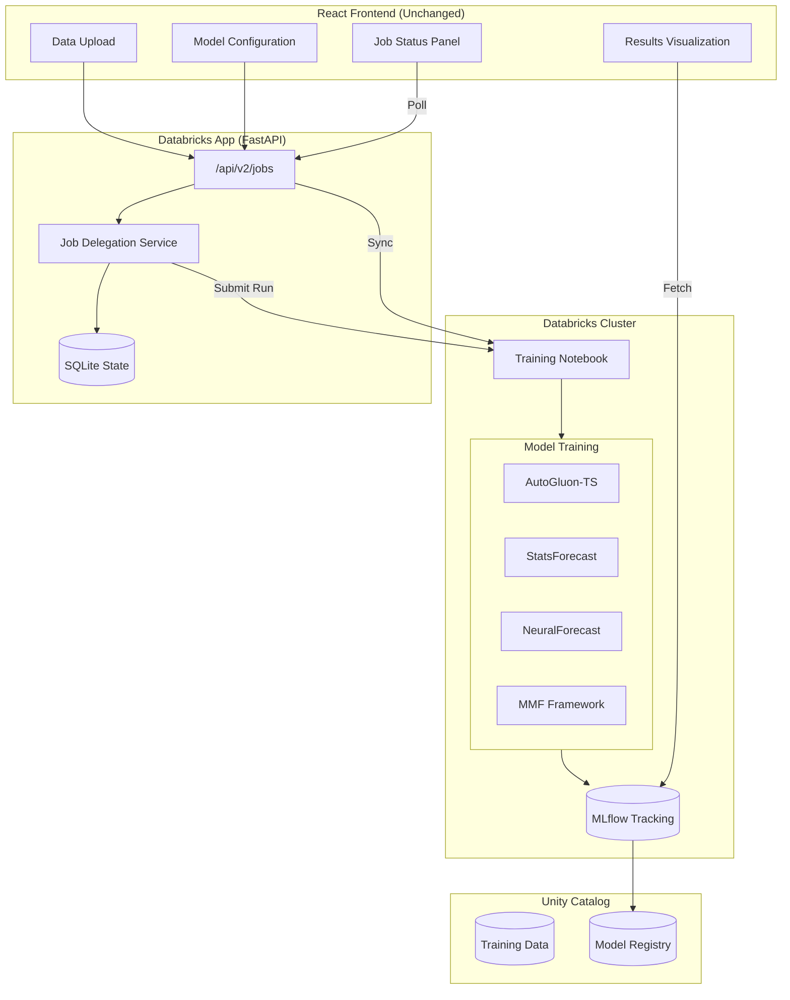
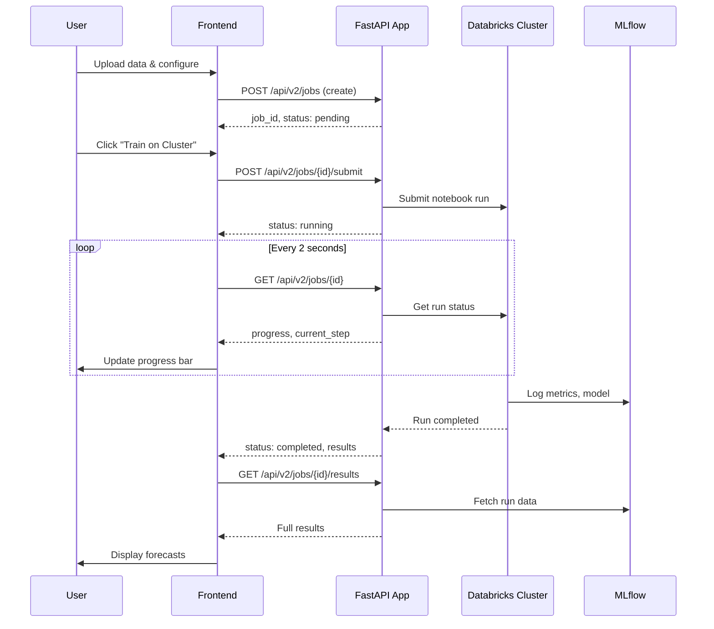

# Databricks Distributed Training Integration

## Goals

Enable production-grade distributed model training on Databricks clusters while:
- Keeping the existing React UI unchanged
- Supporting concurrent users
- Tracking all experiments in MLflow
- Leveraging AutoML libraries (AutoGluon, Nixtla MMF, StatsForecast)

## Non-Goals

- Changing the frontend architecture
- Supporting non-Databricks compute environments
- Real-time streaming forecasts

---

## Current State

The project already has:
- **Job Delegation Service** (`backend/services/job_delegation.py`)
  - Creates/submits jobs to Databricks clusters via SDK
  - Tracks job status, progress, cancellation
  - Persists state in SQLite for recovery
- **Job API** (`backend/services/job_api.py`)
  - REST endpoints: `/api/v2/jobs`
  - Create, submit, status, cancel, list jobs
- **Job State Store** (`backend/services/job_state_store.py`)
  - SQLite-based persistence
  - `TrainingJob` dataclass with full lifecycle tracking

**Missing Components:**
1. Training notebook for cluster execution
2. Frontend integration with job API
3. AutoML/MMF model support
4. MLflow experiment tracking in cluster jobs
5. Result retrieval and display

---

## Proposed Architecture



---

## Implementation Plan

### Phase 1: Training Notebook (Priority: High)

Create a Databricks notebook that:
1. Receives job config as parameters
2. Loads data from Unity Catalog or passed CSV
3. Runs model training with selected AutoML library
4. Logs everything to MLflow
5. Returns results via notebook output

**File**: `notebooks/distributed_training.py`

```python
# Databricks notebook source
# COMMAND ----------
# MAGIC %pip install autogluon.timeseries statsforecast mlforecast

# COMMAND ----------
import json
import mlflow
from autogluon.timeseries import TimeSeriesDataFrame, TimeSeriesPredictor

# Parameters passed from job submission
dbutils.widgets.text("job_id", "")
dbutils.widgets.text("config", "{}")

job_id = dbutils.widgets.get("job_id")
config = json.loads(dbutils.widgets.get("config"))

# COMMAND ----------
# Set up MLflow experiment
experiment_name = f"/Shared/finance-forecasting/jobs/{job_id}"
mlflow.set_experiment(experiment_name)

with mlflow.start_run(run_name=f"job_{job_id[:8]}") as run:
    # Log job config
    mlflow.log_params({
        "job_id": job_id,
        "horizon": config.get("horizon", 12),
        "frequency": config.get("frequency", "W"),
        "models": str(config.get("models", ["prophet"])),
    })

    # Prepare data
    data = config.get("data", [])
    df = pd.DataFrame(data)

    # Train with AutoGluon
    ts_df = TimeSeriesDataFrame.from_data_frame(
        df,
        id_column=config.get("id_col", "item_id"),
        timestamp_column=config.get("time_col", "ds"),
    )

    predictor = TimeSeriesPredictor(
        prediction_length=config["horizon"],
        target=config["target_col"],
        eval_metric="MAPE",
    ).fit(
        ts_df,
        presets="medium_quality",
        time_limit=config.get("time_limit", 600),
    )

    # Get predictions and metrics
    predictions = predictor.predict(ts_df)
    leaderboard = predictor.leaderboard()

    # Log metrics
    best_model = leaderboard.iloc[0]
    mlflow.log_metric("mape", best_model["score_val"])
    mlflow.log_metric("training_time", best_model["fit_time_marginal"])

    # Save predictor
    predictor.save(f"/tmp/predictor_{job_id}")
    mlflow.log_artifacts(f"/tmp/predictor_{job_id}", artifact_path="predictor")

    # Return results
    results = {
        "mlflow_run_id": run.info.run_id,
        "best_model": best_model["model"],
        "mape": float(best_model["score_val"]),
        "leaderboard": leaderboard.to_dict(),
        "forecast": predictions.reset_index().to_dict(orient="records"),
    }

# COMMAND ----------
# Output results for job service to retrieve
dbutils.notebook.exit(json.dumps(results))
```

### Phase 2: Enhanced Job Delegation Service

Update `job_delegation.py` to support:
1. Multiple training modes (AutoGluon, StatsForecast, MMF)
2. Data upload to Unity Catalog temp table
3. Better progress tracking via run events
4. Result caching and retrieval

**Changes to `job_delegation.py`:**

```python
class TrainingMode(Enum):
    AUTOGLUON = "autogluon"
    STATSFORECAST = "statsforecast"
    NEURALFORECAST = "neuralforecast"
    MMF = "mmf"  # Many Model Forecasting
    LEGACY = "legacy"  # Current Prophet/ARIMA

async def submit_job(self, job_id: str) -> TrainingJob:
    job = await self.state_store.get(job_id)

    # Upload data to temporary Unity Catalog table
    temp_table = await self._upload_data_to_uc(job)
    job.config["data_table"] = temp_table

    # Select notebook based on training mode
    mode = TrainingMode(job.config.get("training_mode", "autogluon"))
    notebook_path = self._get_notebook_path(mode)

    # Submit with appropriate cluster config
    run = self.workspace_client.jobs.submit(
        run_name=f"forecast_{job.job_id[:8]}",
        tasks=[
            jobs.SubmitTask(
                task_key="training",
                existing_cluster_id=DEDICATED_CLUSTER_ID,
                notebook_task=jobs.NotebookTask(
                    notebook_path=notebook_path,
                    base_parameters={
                        "job_id": job.job_id,
                        "config": json.dumps(job.config),
                        "data_table": temp_table,
                    }
                ),
            )
        ]
    )
```

### Phase 3: Frontend Integration

Add job management UI components without changing existing flow.

**New Components:**

1. **JobStatusBanner** - Shows active job status at top of page
2. **JobProgressModal** - Detailed progress view when job is running
3. **JobHistoryPanel** - List of past jobs with results

**API Integration:**

```typescript
// services/jobApi.ts
export interface Job {
  job_id: string;
  status: 'pending' | 'submitting' | 'running' | 'completed' | 'failed' | 'cancelled';
  progress: number;
  current_step: string;
  results?: TrainResponse;
}

export const jobApi = {
  create: (config: TrainRequest) =>
    fetch('/api/v2/jobs', { method: 'POST', body: JSON.stringify({ config }) }),

  submit: (jobId: string) =>
    fetch(`/api/v2/jobs/${jobId}/submit`, { method: 'POST' }),

  getStatus: (jobId: string) =>
    fetch(`/api/v2/jobs/${jobId}`),

  cancel: (jobId: string) =>
    fetch(`/api/v2/jobs/${jobId}/cancel`, { method: 'POST' }),

  getResults: (jobId: string) =>
    fetch(`/api/v2/jobs/${jobId}/results`),
};
```

**UI Flow:**



### Phase 4: AutoML Library Integration

Support multiple AutoML frameworks via configuration.

**Training Mode Selection:**

| Mode | Library | Best For | Speed |
|------|---------|----------|-------|
| `autogluon` | AutoGluon-TS | Best accuracy, ensembling | Medium |
| `statsforecast` | Nixtla StatsForecast | Fast statistical models | Fast |
| `neuralforecast` | Nixtla NeuralForecast | Deep learning | Slow |
| `mmf` | Databricks MMF | Production scale, 40+ models | Variable |

**Notebook Selection:**

```python
NOTEBOOK_PATHS = {
    TrainingMode.AUTOGLUON: "/Workspace/Shared/finance-forecast/notebooks/train_autogluon",
    TrainingMode.STATSFORECAST: "/Workspace/Shared/finance-forecast/notebooks/train_statsforecast",
    TrainingMode.NEURALFORECAST: "/Workspace/Shared/finance-forecast/notebooks/train_neuralforecast",
    TrainingMode.MMF: "/Workspace/Shared/finance-forecast/notebooks/train_mmf",
}
```

---

## Configuration

### Environment Variables

```bash
# Enable cluster delegation
ENABLE_CLUSTER_DELEGATION=true

# Dedicated training cluster
DEDICATED_CLUSTER_ID=0123-456789-abc123

# Notebook paths
TRAINING_NOTEBOOK_PATH=/Workspace/Shared/finance-forecast/notebooks/train_autogluon

# State persistence
JOB_STATE_DB_PATH=/dbfs/finance-forecast/jobs.db

# MLflow
MLFLOW_EXPERIMENT_NAME=/Shared/finance-forecasting
```

### Cluster Requirements

| Resource | Minimum | Recommended |
|----------|---------|-------------|
| Workers | 2 | 4-8 |
| Worker Type | i3.xlarge | i3.2xlarge |
| Driver Type | i3.xlarge | i3.xlarge |
| Runtime | 14.3 LTS ML | 15.4 LTS ML |
| Autoscaling | Optional | Enabled |

**Required Libraries on Cluster:**

```
autogluon.timeseries==1.2.0
statsforecast==1.7.0
mlforecast==0.13.0
neuralforecast==1.7.0
mmf-sa==0.5.0
```

---

## Concurrent User Support

### Isolation Strategy

1. **Job-level isolation**: Each user's job runs independently
2. **Data isolation**: Temp tables per job with automatic cleanup
3. **MLflow isolation**: Separate runs per job under shared experiment
4. **Resource isolation**: Cluster autoscaling handles concurrent jobs

### State Management

```python
class TrainingJob:
    job_id: str           # UUID, unique per job
    user_id: str          # User identifier (from auth)
    config: Dict          # Job configuration
    cluster_id: str       # Target cluster
    run_id: Optional[str] # Databricks run ID
    mlflow_run_id: str    # MLflow run ID
    status: JobStatus
    progress: int         # 0-100
    current_step: str
    results: Optional[Dict]
    created_at: datetime
    submitted_at: Optional[datetime]
    completed_at: Optional[datetime]
```

### Concurrency Limits

```python
# Configurable limits
MAX_CONCURRENT_JOBS_PER_USER = int(os.getenv("MAX_JOBS_PER_USER", "3"))
MAX_TOTAL_CONCURRENT_JOBS = int(os.getenv("MAX_TOTAL_JOBS", "10"))

async def create_job(self, user_id: str, config: Dict) -> TrainingJob:
    # Check user limit
    user_jobs = await self.state_store.count_running_jobs(user_id=user_id)
    if user_jobs >= MAX_CONCURRENT_JOBS_PER_USER:
        raise ValueError(f"Maximum concurrent jobs ({MAX_CONCURRENT_JOBS_PER_USER}) reached")

    # Check total limit
    total_jobs = await self.state_store.count_running_jobs()
    if total_jobs >= MAX_TOTAL_CONCURRENT_JOBS:
        raise ValueError("System is at maximum capacity. Please try again later.")
```

---

## MLflow Integration

### Experiment Structure

```
/Shared/finance-forecasting/
├── jobs/
│   ├── {job_id_1}/
│   │   └── run_xxxxx (training run)
│   ├── {job_id_2}/
│   │   └── run_yyyyy
│   └── ...
└── production/
    └── best_models/
```

### Logged Artifacts

| Artifact | Description |
|----------|-------------|
| `config.json` | Job configuration |
| `predictor/` | Saved AutoGluon predictor |
| `forecast.csv` | Forecast results |
| `leaderboard.csv` | Model comparison |
| `metrics.json` | Evaluation metrics |

### Model Registry Integration

```python
# In training notebook
if config.get("register_model", False):
    model_name = f"{config['model_name']}"
    model_uri = f"runs:/{run.info.run_id}/predictor"

    mlflow.register_model(
        model_uri=model_uri,
        name=f"main.forecasting.{model_name}",
        tags={
            "job_id": job_id,
            "best_model": best_model["model"],
            "mape": str(best_model["score_val"]),
        }
    )
```

---

## Rollout Plan

### Week 1: Foundation
- [ ] Create training notebooks (AutoGluon, StatsForecast)
- [ ] Deploy notebooks to workspace
- [ ] Test job submission manually

### Week 2: Backend Enhancement
- [ ] Update job delegation service
- [ ] Add data upload to Unity Catalog
- [ ] Implement result retrieval from MLflow

### Week 3: Frontend Integration
- [ ] Add job status components
- [ ] Integrate with existing training flow
- [ ] Add "Train on Cluster" option

### Week 4: Testing & Documentation
- [ ] End-to-end testing
- [ ] Load testing with concurrent users
- [ ] Documentation and runbook

---

## Risks & Mitigations

| Risk | Mitigation |
|------|------------|
| Cluster availability | Use autoscaling, job queuing |
| Data size limits | Chunk large datasets, use UC tables |
| Long training times | Progress tracking, timeouts, cancellation |
| Cost overruns | Job time limits, user quotas |
| State corruption | SQLite backups, idempotent operations |

---

## Open Questions

1. Should we support serverless compute for smaller jobs?
2. Do we need job priority/queuing?
3. Should results be cached in Unity Catalog?
4. How long to retain job history?

---

## Version

**Status**: Draft
**Author**: debu-sinha
**Created**: January 2026
