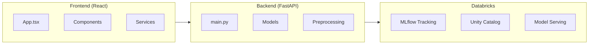
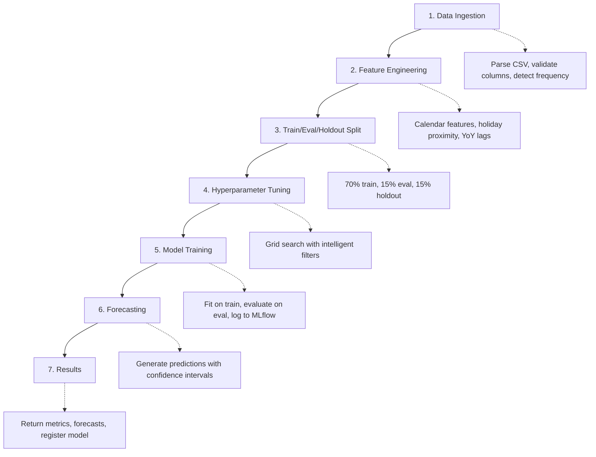
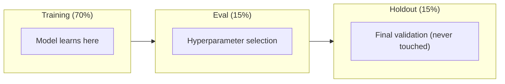

# Developer Guide

> **Technical documentation for extending and deploying the Finance Forecasting Platform**

---

## Table of Contents

1. [Quick Start for Developers](#-quick-start-for-developers)
2. [Architecture Overview](#-architecture-overview)
3. [Environment Setup](#-environment-setup)
4. [Configuration Reference](#-configuration-reference)
5. [API Reference](#-api-reference)
6. [Model Training Pipeline](#-model-training-pipeline)
7. [Feature Engineering](#-feature-engineering)
8. [Adding New Models](#-adding-new-models)
9. [Deployment Guide](#-deployment-guide)
10. [Performance Tuning](#-performance-tuning)
11. [Testing](#-testing)
12. [Changelog](#-changelog)

---

## Quick Start for Developers

### Prerequisites

```bash
# Required
Python 3.9+
Node.js 18+
Git

# Optional (for Databricks deployment)
Databricks CLI
```

### Clone & Install

```bash
# Clone repository
git clone https://github.com/debu-sinha/finance-forecast-app.git
cd finance-forecast-app

# Install Python dependencies
pip install -r requirements.txt

# Install Node dependencies
npm install
```

### Configure Environment

```bash
# Create local environment file
cp .env.example .env.local

# Edit with your Databricks credentials
nano .env.local
```

**Minimum `.env.local`:**
```bash
DATABRICKS_HOST=https://your-workspace.cloud.databricks.com
DATABRICKS_TOKEN=your_personal_access_token
MLFLOW_EXPERIMENT_NAME=/Shared/finance-forecasting
```

### Run Locally

```bash
# Terminal 1: Start backend
python -m uvicorn backend.main:app --reload --port 8000

# Terminal 2: Start frontend
npm run dev
```

Open http://localhost:3000

---

## Architecture Overview



### Directory Structure

```
finance-forecast-app/
├── backend/
│   ├── main.py                 # FastAPI app & routes
│   ├── models/                 # ML model implementations
│   │   ├── prophet.py
│   │   ├── arima.py
│   │   ├── ets.py
│   │   ├── xgboost.py
│   │   └── utils.py
│   ├── preprocessing.py        # Feature engineering
│   ├── simple_mode/            # Simple Mode components
│   │   ├── api.py
│   │   ├── data_profiler.py
│   │   ├── autopilot_config.py
│   │   └── forecast_explainer.py
│   └── schemas.py              # Pydantic models
├── components/                 # React components
├── services/                   # API client services
├── App.tsx                     # Main React app
├── types.ts                    # TypeScript types
└── DEVELOPER_GUIDE.md          # This file
```

---

## Environment Setup

### Local Development

| Variable | Required | Default | Description |
|----------|----------|---------|-------------|
| `DATABRICKS_HOST` | Yes | - | Workspace URL |
| `DATABRICKS_TOKEN` | Yes | - | Personal access token |
| `MLFLOW_EXPERIMENT_NAME` | No | `/Shared/finance-forecasting` | MLflow experiment path |
| `PORT` | No | `8000` | Backend server port |

### Databricks Apps Deployment

| Variable | Required | Value | Description |
|----------|----------|-------|-------------|
| `DATABRICKS_HOST` | Yes | `inherit` | Auto-inherit from workspace |
| `DATABRICKS_TOKEN` | No | - | Not needed (uses workspace auth) |

**Example `app.yaml`:**
```yaml
command:
  - python
  - -m
  - uvicorn
  - backend.main:app
  - --host
  - 0.0.0.0
  - --port
  - "8000"

env:
  - name: DATABRICKS_HOST
    value: "inherit"
  - name: MLFLOW_EXPERIMENT_NAME
    value: "/Shared/finance-forecasting"
```

---

## Configuration Reference

### Performance Tuning

| Variable | Default | Local Dev | Databricks Apps |
|----------|---------|-----------|-----------------|
| `MLFLOW_MAX_WORKERS` | 1 | 4-8 | 1-2 |
| `PROPHET_MAX_COMBINATIONS` | 3 | 9-12 | 3-6 |
| `ARIMA_MAX_COMBINATIONS` | 6 | 12-18 | 4-6 |
| `ETS_MAX_COMBINATIONS` | 4 | 8-12 | 4 |
| `SARIMAX_MAX_COMBINATIONS` | 8 | 16-24 | 6-8 |
| `XGBOOST_MAX_COMBINATIONS` | 4 | 8-16 | 4 |
| `MLFLOW_SKIP_CHILD_RUNS` | false | false | true |

### MLflow & Unity Catalog

| Variable | Default | Description |
|----------|---------|-------------|
| `MLFLOW_EXPERIMENT_NAME` | `/Shared/finance-forecasting` | Experiment path |
| `MLFLOW_SKIP_CHILD_RUNS` | `false` | Skip logging child runs |
| `UC_CATALOG_NAME` | `main` | Unity Catalog catalog |
| `UC_SCHEMA_NAME` | `default` | Unity Catalog schema |
| `UC_MODEL_NAME` | `main.default.finance_forecast_model` | Full model path |

---

## API Reference

### Endpoints Overview

| Endpoint | Method | Description |
|----------|--------|-------------|
| `/api/health` | GET | Health check |
| `/api/train` | POST | Train single model |
| `/api/train-batch` | POST | Train multiple segments |
| `/api/aggregate` | POST | Aggregate data frequency |
| `/api/simple-mode/profile` | POST | Profile data (Simple Mode) |
| `/api/simple-mode/forecast` | POST | Generate forecast (Simple Mode) |

### POST `/api/train`

**Request:**
```json
{
  "data": [{"ds": "2024-01-01", "y": 100000, "promo": 1}],
  "time_col": "ds",
  "target_col": "y",
  "covariates": ["promo"],
  "horizon": 12,
  "frequency": "weekly",
  "models": ["prophet", "arima"],
  "seasonality_mode": "multiplicative",
  "random_seed": 42
}
```

**Response:**
```json
{
  "results": [{
    "model": "prophet",
    "metrics": {"mape": 2.5, "rmse": 1500, "r2": 0.95},
    "forecast": [{"ds": "2024-04-01", "yhat": 105000, "yhat_lower": 98000, "yhat_upper": 112000}],
    "run_id": "abc123..."
  }],
  "best_model": "prophet"
}
```

### POST `/api/train-batch`

**Request:**
```json
{
  "requests": [
    {"data": [...], "filters": {"region": "US"}},
    {"data": [...], "filters": {"region": "EU"}}
  ],
  "max_workers": 4
}
```

**Response:**
```json
{
  "total_requests": 2,
  "successful": 2,
  "failed": 0,
  "results": [
    {"segment_id": "region=US", "status": "success", "result": {...}},
    {"segment_id": "region=EU", "status": "success", "result": {...}}
  ]
}
```

---

## Model Training Pipeline

### Pipeline Flow



### Data Splits



---

## Feature Engineering

### Features Added by `preprocessing.py`

#### Calendar Features (Always Added)

| Feature | Type | Description |
|---------|------|-------------|
| `day_of_week` | int | 0=Monday, 6=Sunday |
| `is_weekend` | int | 1 if Saturday/Sunday |
| `month` | int | 1-12 |
| `quarter` | int | 1-4 |
| `day_of_month` | int | 1-31 |
| `week_of_year` | int | 1-52 |
| `time_index` | int | Sequential index |
| `year` | int | Year from date |

#### Holiday Week Features (Always Added)

| Feature | Description |
|---------|-------------|
| `is_thanksgiving_week` | Thanksgiving week flag |
| `is_christmas_week` | Christmas week flag |
| `is_black_friday_week` | Black Friday week flag |
| `is_new_years_week` | New Year's week flag |
| ... | Other major US holidays |

#### Holiday Proximity Features - Weekly Data (v1.2.0+)

| Feature | Type | Description |
|---------|------|-------------|
| `weeks_to_thanksgiving` | int | Weeks until Thanksgiving (0-99) |
| `weeks_after_thanksgiving` | int | Weeks since Thanksgiving (0-99) |
| `weeks_to_christmas` | int | Weeks until Christmas (0-99) |
| `weeks_after_christmas` | int | Weeks since Christmas (0-99) |
| `is_pre_thanksgiving` | int | Within 2 weeks before Thanksgiving |
| `is_post_thanksgiving` | int | Within 2 weeks after Thanksgiving |
| `is_pre_christmas` | int | Within 2 weeks before Christmas |
| `is_post_christmas` | int | Within 2 weeks after Christmas |

#### Holiday Proximity Features - Daily Data (v1.3.0+)

| Feature | Type | Description |
|---------|------|-------------|
| `days_to_thanksgiving` | int | Days until next Thanksgiving (0-365) |
| `days_since_thanksgiving` | int | Days since last Thanksgiving (0-365) |
| `days_to_christmas` | int | Days until next Christmas (0-365) |
| `days_since_christmas` | int | Days since last Christmas (0-365) |
| `days_to_black_friday` | int | Days until next Black Friday (0-365) |
| `days_since_black_friday` | int | Days since last Black Friday (0-365) |
| `days_to_easter` | int | Days until next Easter (0-365) |
| `days_since_easter` | int | Days since last Easter (0-365) |
| `days_to_super_bowl` | int | Days until next Super Bowl (0-365) |
| `days_since_super_bowl` | int | Days since last Super Bowl (0-365) |
| `is_thanksgiving_window` | int | Within ±3 days of Thanksgiving |
| `is_christmas_window` | int | Within ±3 days of Christmas |
| `is_black_friday_window` | int | Within ±3 days of Black Friday |
| `is_easter_window` | int | Within ±3 days of Easter |
| `is_super_bowl_window` | int | Within ±3 days of Super Bowl |

#### Prophet Multi-Day Holiday Windows (v1.3.0+)

Prophet now uses custom holidays DataFrame with `lower_window` and `upper_window` to capture multi-day effects:

| Holiday | Window | Effect Period |
|---------|--------|---------------|
| Thanksgiving | -1 to +3 | Wed prep through Black Friday weekend |
| Christmas | -7 to +1 | Full week before + day after |
| Black Friday | 0 to +2 | Fri-Sun shopping weekend |
| Super Bowl | -1 to 0 | Day before + event day |
| Mother's/Father's Day | -1 to 0 | Weekend effect |
| Memorial/Labor Day | -2 to 0 | Weekend celebration |

#### YoY Lag Features (Conditional)

| Frequency | Lag Features | Min Data Required |
|-----------|--------------|-------------------|
| Daily | `lag_364`, `lag_364_avg` | 400+ rows |
| Weekly | `lag_52`, `lag_52_avg` | 60+ rows |
| Monthly | `lag_12`, `lag_12_avg` | 15+ rows |

### Custom Features

To add custom features, edit `backend/preprocessing.py`:

```python
def enhance_features_for_forecasting(df, date_col, target_col, promo_cols, frequency):
    # ... existing code ...

    # Add your custom features here
    df['is_month_end'] = dates.dt.is_month_end.astype(int)
    df['is_quarter_end'] = dates.dt.is_quarter_end.astype(int)

    return df
```

---

## Adding New Models

### Step 1: Create Model File

Create `backend/models/your_model.py`:

```python
import pandas as pd
import numpy as np
from typing import Dict, Any, List
import mlflow

def train_your_model(
    train_df: pd.DataFrame,
    eval_df: pd.DataFrame,
    time_col: str,
    target_col: str,
    covariates: List[str],
    horizon: int,
    frequency: str,
    random_seed: int = 42
) -> Dict[str, Any]:
    """Train your custom model."""

    # 1. Set random seed
    np.random.seed(random_seed)

    # 2. Prepare data
    # ...

    # 3. Train model
    # ...

    # 4. Generate forecast
    # ...

    # 5. Calculate metrics
    from backend.models.utils import compute_metrics
    metrics = compute_metrics(actuals, predictions)

    # 6. Return results
    return {
        'model': fitted_model,
        'forecast': forecast_df,
        'metrics': metrics,
        'best_params': params
    }
```

### Step 2: Register in main.py

Add to `backend/main.py`:

```python
from backend.models.your_model import train_your_model

# In the train endpoint
if 'your_model' in request.models:
    result = train_your_model(
        train_df=train_df,
        eval_df=eval_df,
        # ... other params
    )
    results.append(create_model_result('your_model', result))
```

### Step 3: Add to Types

**`types.ts`:**
```typescript
export type ModelType = 'prophet' | 'arima' | 'ets' | 'sarimax' | 'xgboost' | 'your_model';
```

**`backend/schemas.py`:**
```python
models: List[str] = Field(
    default=["prophet"],
    description="Models: 'prophet', 'arima', 'ets', 'sarimax', 'xgboost', 'your_model'"
)
```

---

## Deployment Guide

### Local Development

```bash
# Start backend
python -m uvicorn backend.main:app --reload --port 8000

# Start frontend
npm run dev

# Access at http://localhost:3000
```

### Databricks Apps Deployment

**Step 1: Build Frontend**
```bash
npm run build
```

**Step 2: Configure app.yaml**
```yaml
command:
  - python
  - -m
  - uvicorn
  - backend.main:app
  - --host
  - 0.0.0.0
  - --port
  - "8000"

env:
  - name: DATABRICKS_HOST
    value: "inherit"
  - name: MLFLOW_MAX_WORKERS
    value: "1"
  - name: PROPHET_MAX_COMBINATIONS
    value: "3"
```

**Step 3: Deploy**
```bash
databricks bundle deploy
```

**Step 4: Access**
Navigate to Apps > finance-forecast-app in your Databricks workspace.

### Model Serving Endpoint

**Deploy trained model:**
```bash
POST /api/deploy
{
  "run_id": "abc123...",
  "endpoint_name": "finance-forecast"
}
```

---

## Performance Tuning

### Databricks Apps Constraints

| Resource | Limit |
|----------|-------|
| vCPU | 4 |
| RAM | 12GB |
| Max Parallel Workers | 1-2 recommended |

### Optimization Strategies

**1. Reduce Hyperparameter Grid**
```bash
PROPHET_MAX_COMBINATIONS=3
ARIMA_MAX_COMBINATIONS=4
```

**2. Skip MLflow Child Runs**
```bash
MLFLOW_SKIP_CHILD_RUNS=true
```

**3. Pre-aggregate Data**
```python
# Daily to weekly
df.resample('W', on='date').agg({'value': 'sum'})
```

**4. Limit Models**
Train only 1-2 models instead of all 5.

### Performance Benchmarks

| Data Size | 1 Model | 3 Models | 5 Models |
|-----------|---------|----------|----------|
| 1K rows | ~30s | ~90s | ~2.5min |
| 10K rows | ~1min | ~3min | ~5min |
| 50K rows | ~3min | ~10min | ~15min |

---

## Testing

### Run Tests

```bash
# Run all tests
python -m pytest backend/tests/

# Run specific test
python backend/tests/test_simple_mode_e2e.py
```

### Test Coverage

| Area | Tests | Status |
|------|-------|--------|
| Data Profiler | 1 | Passing |
| Holiday Features | 1 | Passing |
| Data Leakage Prevention | 1 | Passing |
| Time Series Split | 1 | Passing |
| Metric Calculation | 1 | Passing |
| Future Features | 1 | Passing |
| Autopilot Config | 1 | Passing |
| Forecast Explainer | 1 | Passing |
| MLflow Config | 1 | Passing |
| Thanksgiving Dates | 1 | Passing |
| Week Frequency Detection | 1 | Passing |
| Reproducibility | 1 | Passing |

---

## Changelog

### v1.3.1 (January 2026)

**Bug Fixes:**
- Fixed Super Bowl date calculation for 2022+ (NFL moved to second Sunday of February)

### v1.3.0 (January 2026)

**New Features - World-Class Holiday Handling:**
- Daily holiday proximity features (`days_to_*`, `days_since_*`) for 5 key holidays
- Multi-day holiday effect windows (`is_*_window`) for Thanksgiving, Christmas, Black Friday, Easter, Super Bowl
- Prophet custom holidays DataFrame with `lower_window`/`upper_window` for multi-day effects
- Easter, Super Bowl, Mother's Day, Father's Day date calculations added
- Weekend indicator (`is_weekend`) ensured for all daily data

**New Features - Forecast Quality:**
- ARIMA degenerate order filtering (excludes random walk models 0,1,0)
- Holiday effect calculation from covariate impacts (fixes $0 display)
- Improved holiday effect reporting in forecast breakdown

**Bug Fixes:**
- Fixed flat forecasts when ARIMA(0,1,0) random walk was selected
- Fixed holiday effect showing $0 in forecast breakdown
- Fixed Expert Mode forecast dates starting from eval end instead of user's end_date

### v1.2.0 (December 29, 2024)

**New Features:**
- Holiday proximity features (8 new features for Thanksgiving/Christmas)
- Stricter MAPE thresholds for financial forecasting
- MLflow logging optimization (`MLFLOW_SKIP_CHILD_RUNS`)
- Comprehensive adversarial test suite (12 tests)

**Improvements:**
- Thanksgiving date calculation now accurate for all years
- Week frequency auto-detection (W-MON, W-TUE, etc.)
- Intelligent hyperparameter filters based on data profile

### v1.1.0 (December 2024)

**New Features:**
- Batch training and deployment
- Pre-deployment inference testing
- Simple Mode for finance users

**Bug Fixes:**
- Weekly date alignment fix
- Prophet regressor consistency fix

### v1.0.0 (Initial Release)

- Core forecasting with 5 models
- MLflow integration
- Unity Catalog support
- React frontend

---

## Support

**Issues:** https://github.com/debu-sinha/finance-forecast-app/issues

**Author:** debu-sinha

---

**Version:** 1.3.1
**Last Updated:** January 2026
