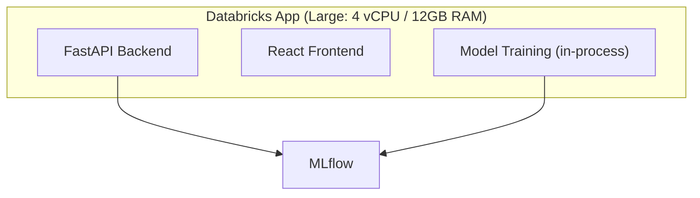
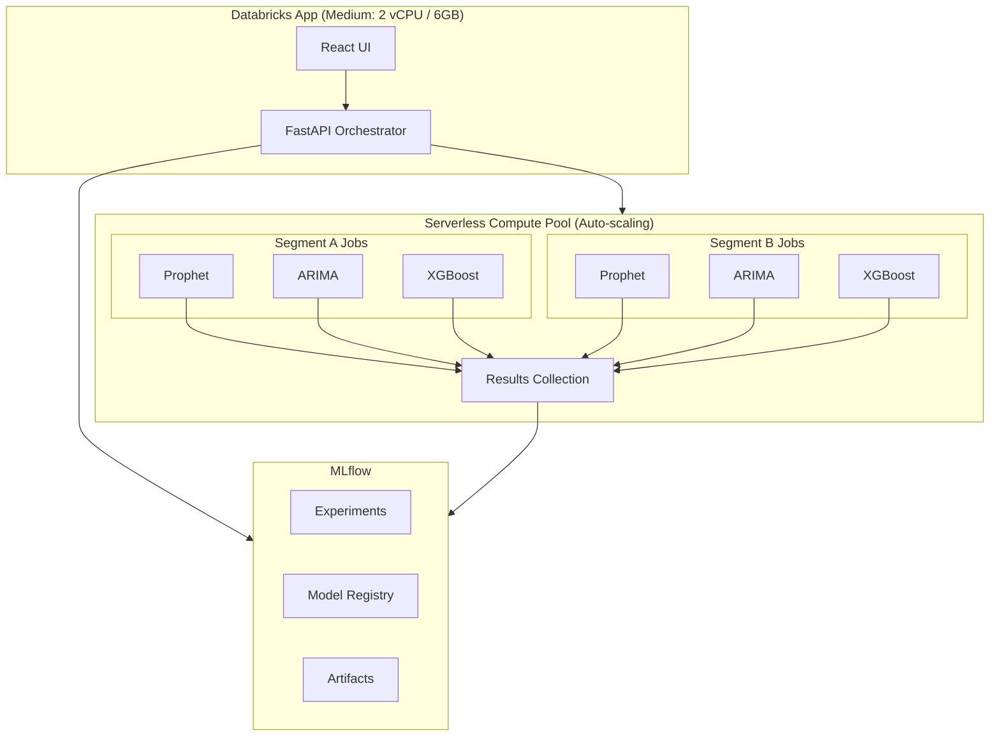

# Scalable Architecture for Finance Forecasting App

> **Status: PLANNED** - Design document for future scaling improvements

---

## Implementation Status

| Feature | Status | Notes |
|---------|--------|-------|
| In-App Batch Training | ✅ Implemented | Sequential with progress tracking |
| Router Model Deployment | ✅ Implemented | Single endpoint for all segments |
| Pre-deployment Testing | ✅ Implemented | Validates models before registration |
| Serverless Job Offload | 🔄 Planned | Future enhancement |
| Event-Driven Retraining | 🔄 Planned | Future enhancement |

---

## Current Architecture (Optimized)



**Current Limitations:**
- Training blocks the App
- Max 4 parallel workers
- Memory constrained to 12GB
- Cannot scale beyond single instance

---

## Proposed Scalable Architecture



**Benefits:**
- App stays responsive (UI never blocked)
- Unlimited parallel training jobs
- Auto-scaling compute (pay per use)
- Each job gets dedicated resources
- No memory constraints per model

---

## Implementation Design

### 1. Job Submission Service

```python
# backend/services/serverless_training.py

from databricks.sdk import WorkspaceClient
from databricks.sdk.service import jobs
from typing import List, Dict, Any
import json
import uuid

class ServerlessTrainingService:
    """
    Offloads model training to Databricks Serverless Jobs.
    The App orchestrates; Serverless computes.
    """

    def __init__(self):
        self.client = WorkspaceClient()
        self.training_notebook_path = "/Shared/finance-forecasting/train_model"

    def submit_training_job(
        self,
        model_type: str,
        segment_id: str,
        training_config: Dict[str, Any],
        data_path: str  # Path to data in Unity Catalog or DBFS
    ) -> str:
        """
        Submit a single model training job to serverless compute.
        Returns: job_run_id for tracking
        """
        run_name = f"train_{model_type}_{segment_id}_{uuid.uuid4().hex[:8]}"

        # Submit to serverless (no cluster_id = serverless)
        waiter = self.client.jobs.submit(
            run_name=run_name,
            tasks=[
                jobs.SubmitTask(
                    task_key=f"train_{model_type}",
                    notebook_task=jobs.NotebookTask(
                        notebook_path=self.training_notebook_path,
                        base_parameters={
                            "model_type": model_type,
                            "segment_id": segment_id,
                            "config": json.dumps(training_config),
                            "data_path": data_path
                        }
                    ),
                    # No existing_cluster_id = uses serverless
                    timeout_seconds=3600,  # 1 hour max
                )
            ]
        )

        return waiter.run_id

    def submit_batch_training(
        self,
        segments: List[Dict],
        models: List[str],
        training_config: Dict[str, Any],
        data_path: str
    ) -> Dict[str, List[str]]:
        """
        Submit parallel training jobs for all segment/model combinations.

        Example: 10 segments × 5 models = 50 parallel serverless jobs
        """
        job_runs = {}

        for segment in segments:
            segment_id = segment['segment_id']
            job_runs[segment_id] = []

            for model_type in models:
                run_id = self.submit_training_job(
                    model_type=model_type,
                    segment_id=segment_id,
                    training_config=training_config,
                    data_path=data_path
                )
                job_runs[segment_id].append({
                    'model': model_type,
                    'run_id': run_id
                })

        return job_runs

    def get_job_status(self, run_id: str) -> Dict[str, Any]:
        """Check status of a training job."""
        run = self.client.jobs.get_run(run_id=run_id)
        return {
            'run_id': run_id,
            'state': run.state.life_cycle_state.value,
            'result_state': run.state.result_state.value if run.state.result_state else None,
            'start_time': run.start_time,
            'end_time': run.end_time
        }

    def wait_for_jobs(self, run_ids: List[str], timeout_minutes: int = 60) -> List[Dict]:
        """Wait for multiple jobs to complete."""
        results = []
        for run_id in run_ids:
            try:
                run = self.client.jobs.get_run_output(run_id=run_id)
                results.append({
                    'run_id': run_id,
                    'status': 'success',
                    'output': run.notebook_output.result if run.notebook_output else None
                })
            except Exception as e:
                results.append({
                    'run_id': run_id,
                    'status': 'failed',
                    'error': str(e)
                })
        return results
```

### 2. Training Notebook (runs on serverless)

```python
# notebooks/train_model.py (Databricks Notebook)
# This runs on serverless compute, not in the App

# Parameters from job submission
dbutils.widgets.text("model_type", "prophet")
dbutils.widgets.text("segment_id", "")
dbutils.widgets.text("config", "{}")
dbutils.widgets.text("data_path", "")

import json
import mlflow
from datetime import datetime

model_type = dbutils.widgets.get("model_type")
segment_id = dbutils.widgets.get("segment_id")
config = json.loads(dbutils.widgets.get("config"))
data_path = dbutils.widgets.get("data_path")

# Load data from Unity Catalog or Delta table
df = spark.read.format("delta").load(data_path)
df_filtered = df.filter(f"segment_id = '{segment_id}'").toPandas()

# Import training functions
# These would be packaged as a wheel or available in workspace
if model_type == "prophet":
    from forecasting.models.prophet import train_prophet_model
    result = train_prophet_model(df_filtered, **config)
elif model_type == "arima":
    from forecasting.models.arima import train_arima_model
    result = train_arima_model(df_filtered, **config)
elif model_type == "xgboost":
    from forecasting.models.xgboost import train_xgboost_model
    result = train_xgboost_model(df_filtered, **config)
# ... other models

# Return results (stored in job output)
dbutils.notebook.exit(json.dumps({
    "segment_id": segment_id,
    "model_type": model_type,
    "run_id": result['run_id'],
    "metrics": result['metrics'],
    "model_uri": result['model_uri']
}))
```

### 3. Updated API Endpoints

```python
# backend/main.py - New endpoints for serverless training

from backend.services.serverless_training import ServerlessTrainingService

serverless_service = ServerlessTrainingService()

@app.post("/api/train-serverless")
async def train_serverless(request: TrainRequest):
    """
    Submit training to serverless compute.
    Returns immediately with job IDs for polling.
    """
    # 1. Save data to Unity Catalog / Delta table
    data_path = save_training_data(request.data, request.segment_id)

    # 2. Submit serverless job
    run_id = serverless_service.submit_training_job(
        model_type=request.models[0],  # One model per job
        segment_id=request.segment_id or "default",
        training_config={
            "time_col": request.time_col,
            "target_col": request.target_col,
            "covariates": request.covariates,
            "horizon": request.horizon,
            "frequency": request.frequency,
        },
        data_path=data_path
    )

    return {"status": "submitted", "run_id": run_id}


@app.post("/api/train-batch-serverless")
async def train_batch_serverless(request: BatchTrainRequest):
    """
    Submit batch training - each segment/model combo runs as separate serverless job.
    Can scale to 100s of parallel jobs.
    """
    # Save batch data
    data_path = save_batch_data(request.data)

    # Submit all jobs (returns immediately)
    job_runs = serverless_service.submit_batch_training(
        segments=request.segments,
        models=request.models,
        training_config={...},
        data_path=data_path
    )

    return {
        "status": "submitted",
        "total_jobs": sum(len(runs) for runs in job_runs.values()),
        "job_runs": job_runs
    }


@app.get("/api/job-status/{run_id}")
async def get_job_status(run_id: str):
    """Poll for job completion status."""
    return serverless_service.get_job_status(run_id)


@app.get("/api/batch-status")
async def get_batch_status(run_ids: List[str]):
    """Get status of multiple jobs."""
    statuses = [serverless_service.get_job_status(rid) for rid in run_ids]

    completed = sum(1 for s in statuses if s['state'] == 'TERMINATED')
    failed = sum(1 for s in statuses if s['result_state'] == 'FAILED')
    running = sum(1 for s in statuses if s['state'] == 'RUNNING')

    return {
        "total": len(run_ids),
        "completed": completed,
        "failed": failed,
        "running": running,
        "pending": len(run_ids) - completed - running,
        "details": statuses
    }
```

### 4. Frontend Changes

```typescript
// services/databricksApi.ts - Updated for async training

export async function trainServerless(config: TrainConfig): Promise<{ run_id: string }> {
  const response = await fetch('/api/train-serverless', {
    method: 'POST',
    body: JSON.stringify(config)
  });
  return response.json();
}

export async function pollJobStatus(runId: string): Promise<JobStatus> {
  const response = await fetch(`/api/job-status/${runId}`);
  return response.json();
}

export async function waitForTraining(runId: string): Promise<TrainResult> {
  // Poll every 5 seconds until complete
  while (true) {
    const status = await pollJobStatus(runId);

    if (status.state === 'TERMINATED') {
      if (status.result_state === 'SUCCESS') {
        // Fetch results from MLflow
        return await getTrainingResults(runId);
      } else {
        throw new Error(`Training failed: ${status.error}`);
      }
    }

    await new Promise(resolve => setTimeout(resolve, 5000));
  }
}
```

---

## Comparison: Current vs Serverless

| Aspect | Current (In-App) | Serverless Architecture |
|--------|------------------|------------------------|
| **Max Parallel Jobs** | 2-4 (limited by App RAM) | 100+ (unlimited) |
| **Memory per Model** | Shared 12GB | Dedicated per job |
| **App Responsiveness** | Blocked during training | Always responsive |
| **Cost Model** | Fixed (App always running) | Pay per training job |
| **Scaling** | Manual (change App size) | Automatic |
| **Training Time (50 segments)** | ~30-60 min (sequential batches) | ~5-10 min (all parallel) |
| **Failure Isolation** | One failure affects all | Jobs independent |

---

## Cost Analysis

### Current Architecture (Large App)
```
App running 24/7:
- 1 DBU/hour × 24 hours × 30 days = 720 DBU/month
- Plus compute costs
```

### Serverless Architecture (Medium App + Serverless Jobs)
```
Medium App (UI only):
- 0.5 DBU/hour × 24 hours × 30 days = 360 DBU/month

Serverless Training (pay per use):
- Assume 100 training jobs/day × 5 min each = 8.3 hours
- ~8 DBU/day × 30 days = 240 DBU/month (estimated)

Total: ~600 DBU/month (potentially less if usage is lower)
```

**Cost savings: 15-30% + unlimited scaling**

---

## Migration Path

### Phase 1: Hybrid (Recommended First Step)
```
┌─────────────────────────────────────────────────────────────┐
│  Keep current in-App training for small jobs (<5 segments)  │
│  Use serverless for batch training (>5 segments)            │
└─────────────────────────────────────────────────────────────┘
```

### Phase 2: Full Serverless
```
┌─────────────────────────────────────────────────────────────┐
│  All training on serverless                                 │
│  App is pure UI + orchestration                             │
│  Downgrade App to Medium tier (save costs)                  │
└─────────────────────────────────────────────────────────────┘
```

### Phase 3: Event-Driven (Future)
```
┌─────────────────────────────────────────────────────────────┐
│  Delta table triggers                                       │
│  Automatic retraining on new data                           │
│  Scheduled batch jobs                                       │
└─────────────────────────────────────────────────────────────┘
```

---

## Implementation Checklist

### Already Implemented (v1.1.0)
- [x] Batch training UI with progress tracking
- [x] Router model for multi-segment deployment
- [x] Pre-deployment inference testing
- [x] Sequential segment processing
- [x] MAPE statistics across segments

### Future Serverless Migration
- [ ] Create training notebook in workspace
- [ ] Package model training code as wheel
- [ ] Add serverless training service
- [ ] Create Delta tables for training data
- [ ] Add job submission endpoints
- [ ] Add polling/status endpoints
- [ ] Update frontend for async training
- [ ] Add progress tracking UI
- [ ] Test with small batch
- [ ] Performance benchmark
- [ ] Cost monitoring setup

---

## References

- [Databricks Serverless Jobs](https://docs.databricks.com/aws/en/jobs/run-serverless-jobs)
- [Databricks SDK for Python](https://databricks-sdk-py.readthedocs.io/en/latest/workspace/jobs/jobs.html)
- [Databricks Apps Compute Sizes](https://docs.databricks.com/aws/en/dev-tools/databricks-apps/compute-size)
