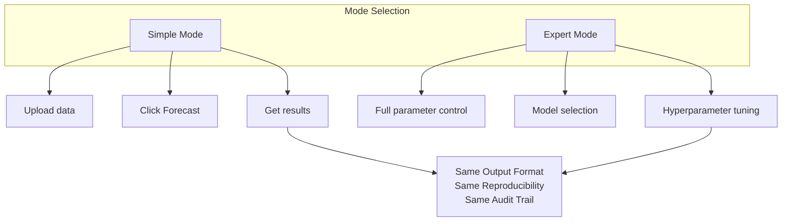
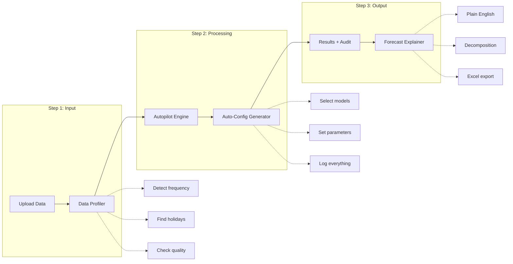
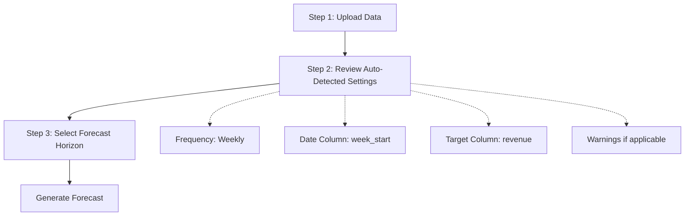
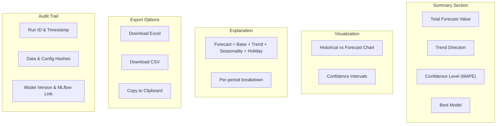

# Simple Mode Design: Autopilot Forecasting

> **Status: IMPLEMENTED** - All core features are live in v1.2.0

---

## Implementation Status

| Component | Status | Location |
|-----------|--------|----------|
| Data Profiler | ✅ Implemented | `backend/simple_mode/data_profiler.py` |
| Autopilot Config | ✅ Implemented | `backend/simple_mode/autopilot_config.py` |
| Forecast Explainer | ✅ Implemented | `backend/simple_mode/forecast_explainer.py` |
| Excel Exporter | ✅ Implemented | `backend/simple_mode/excel_exporter.py` |
| API Endpoints | ✅ Implemented | `backend/simple_mode/api.py` |
| Mode Toggle UI | ✅ Implemented | `App.tsx` |
| By-Slice Forecasting | ✅ Implemented | Multi-segment support |

---

## Executive Summary

Finance users currently use Excel/Google Sheets for forecasting because:
1. **Transparency** - They can see every formula, every cell
2. **Reproducibility** - Same inputs = same outputs, always
3. **Auditability** - Can trace back any number to its source
4. **Simplicity** - No ML knowledge required

Our ML system must match or exceed these properties while delivering better accuracy.

---

## Design Principles

### 1. Deterministic Reproducibility
Every forecast must be 100% reproducible. Given the same inputs, produce identical outputs.

**Reproducibility Contract:**
- Input Hash + Config Hash + Model Version = Deterministic Output
- Fixed random seeds (no stochastic variance between runs)
- Versioned model artifacts (immutable once created)
- Configuration snapshot stored with every run
- Data fingerprint (hash) logged for audit

### 2. Excel-Level Transparency
Users must be able to understand and explain every forecast number.

**Transparency Layers:**
| Level | Description | Example |
|-------|-------------|---------|
| 1. Summary | High-level forecast | "Forecast: $1.2M for Q1 2025" |
| 2. Components | Breakdown | "Base: $1.0M + Trend: +$150K + Holiday: +$50K" |
| 3. Audit Trail | Technical details | Full config, data hash, model params |
| 4. Export | Downloadable | Excel with formulas |

### 3. Progressive Disclosure
Simple by default, complexity available on demand.



---

## System Architecture

### High-Level Flow



### Component Design

#### 1. Data Profiler (Auto-Detection)

```python
class DataProfiler:
    """
    Automatically analyzes uploaded data and extracts configuration.
    Eliminates need for user to specify parameters.
    """

    def profile(self, df: pd.DataFrame) -> DataProfile:
        return DataProfile(
            # Auto-detected from data
            frequency=self._detect_frequency(df),        # daily/weekly/monthly
            date_column=self._detect_date_column(df),    # find the date col
            target_column=self._detect_target_column(df), # find numeric target

            # Data quality assessment
            date_range=self._get_date_range(df),
            missing_periods=self._find_gaps(df),
            outliers=self._detect_outliers(df),

            # Holiday coverage analysis
            holidays_in_data=self._find_holidays(df),
            holiday_coverage_score=self._score_holiday_coverage(df),

            # Recommendations
            min_recommended_history="2 years",
            actual_history=self._calculate_history_length(df),
            data_quality_score=self._calculate_quality_score(df),

            # Warnings for user
            warnings=self._generate_warnings(df),
        )

    def _detect_frequency(self, df) -> str:
        """Detect if data is daily, weekly, or monthly."""
        date_col = self._detect_date_column(df)
        dates = pd.to_datetime(df[date_col]).sort_values()
        median_gap = dates.diff().median().days

        if median_gap <= 1:
            return "daily"
        elif median_gap <= 7:
            return "weekly"
        else:
            return "monthly"

    def _generate_warnings(self, df) -> List[Warning]:
        """Generate user-friendly warnings about data issues."""
        warnings = []

        history_months = self._calculate_history_length(df)
        if history_months < 24:
            warnings.append(Warning(
                level="medium",
                message=f"Only {history_months} months of history. Holiday forecasts may be less accurate.",
                recommendation="Provide 2+ years of data for best holiday accuracy."
            ))

        if history_months < 12:
            warnings.append(Warning(
                level="high",
                message="Less than 1 year of data. Cannot learn seasonal patterns.",
                recommendation="Provide at least 12 months of historical data."
            ))

        return warnings
```

#### 2. Autopilot Configuration Generator

```python
class AutopilotConfig:
    """
    Generates optimal configuration based on data profile.
    User doesn't need to set any parameters.
    """

    def generate(self, profile: DataProfile) -> ForecastConfig:
        """Generate best configuration for this data."""

        # Select models based on data characteristics
        models = self._select_models(profile)

        # Set horizon based on frequency
        horizon = self._recommend_horizon(profile)

        # Configure each model optimally
        model_configs = {}
        for model in models:
            model_configs[model] = self._get_optimal_params(model, profile)

        return ForecastConfig(
            # Auto-determined settings
            frequency=profile.frequency,
            date_column=profile.date_column,
            target_column=profile.target_column,
            horizon=horizon,

            # Model selection (auto)
            models=models,
            model_configs=model_configs,

            # Reproducibility settings (fixed)
            random_seed=42,

            # Metadata for audit
            config_version="1.0",
            generated_at=datetime.now().isoformat(),
            generation_mode="autopilot",

            # Hash for reproducibility
            config_hash=self._compute_hash(),
        )

    def _select_models(self, profile: DataProfile) -> List[str]:
        """Select best models for this data profile."""

        models = []

        # Always include Prophet (robust, handles holidays)
        models.append("prophet")

        # Add XGBoost if enough data for feature learning
        if profile.actual_history_months >= 12:
            models.append("xgboost")

        # Add ARIMA for strong trend/seasonality
        if profile.has_clear_seasonality:
            models.append("arima")

        # ETS for simpler patterns
        if profile.actual_history_months < 24:
            models.append("ets")  # More robust with limited data

        return models

    def _recommend_horizon(self, profile: DataProfile) -> int:
        """Recommend forecast horizon based on frequency and use case."""
        defaults = {
            "daily": 30,    # 1 month ahead
            "weekly": 12,   # 3 months ahead
            "monthly": 6,   # 6 months ahead
        }
        return defaults.get(profile.frequency, 12)
```

#### 3. Forecast Explainer (Excel-Like Transparency)

```python
class ForecastExplainer:
    """
    Provides Excel-level transparency for ML forecasts.
    Users can understand and explain every number.
    """

    def explain(self, forecast_result: ForecastResult) -> ForecastExplanation:
        """Generate human-readable explanation of forecast."""

        return ForecastExplanation(
            # Summary (what finance users see first)
            summary=self._generate_summary(forecast_result),

            # Decomposition (like Excel formula breakdown)
            components=self._decompose_forecast(forecast_result),

            # Confidence and caveats
            confidence=self._assess_confidence(forecast_result),
            caveats=self._generate_caveats(forecast_result),

            # Full audit trail
            audit_trail=self._build_audit_trail(forecast_result),
        )

    def _generate_summary(self, result) -> str:
        """Plain English summary for executives."""
        total = result.forecast_values.sum()
        trend = "increasing" if result.trend_direction > 0 else "decreasing"

        return f"""
        Forecast Summary:
        - Total forecasted value: ${total:,.0f}
        - Trend: {trend} at {abs(result.trend_pct):.1f}%
        - Confidence: {result.confidence_level}
        - Best model: {result.best_model} (MAPE: {result.mape:.1f}%)
        """

    def _decompose_forecast(self, result) -> ForecastComponents:
        """Break down forecast like Excel formula."""

        # Similar to: =BASE + TREND + SEASONALITY + HOLIDAY_EFFECT
        return ForecastComponents(
            base_value=result.base_forecast,
            trend_effect=result.trend_component,
            seasonal_effect=result.seasonal_component,
            holiday_effect=result.holiday_component,

            # Show the "formula"
            formula="Forecast = Base + Trend + Seasonality + Holiday Effect",

            # Per-period breakdown
            period_breakdown=[
                {
                    "period": period.date,
                    "forecast": period.value,
                    "base": period.base,
                    "trend": period.trend,
                    "seasonal": period.seasonal,
                    "holiday": period.holiday,
                    "explanation": f"${period.base:,.0f} base + ${period.trend:,.0f} trend + ${period.seasonal:,.0f} seasonal + ${period.holiday:,.0f} holiday"
                }
                for period in result.periods
            ]
        )

    def _build_audit_trail(self, result) -> AuditTrail:
        """Complete audit trail for compliance/reproducibility."""

        return AuditTrail(
            # When
            run_timestamp=result.timestamp,

            # What data
            input_data_hash=result.data_hash,
            input_row_count=result.input_rows,
            input_date_range=result.date_range,

            # What configuration
            config_hash=result.config_hash,
            config_snapshot=result.config,  # Full config stored

            # What model
            model_type=result.model_type,
            model_version=result.model_version,
            model_uri=result.mlflow_model_uri,
            mlflow_run_id=result.run_id,

            # What output
            output_hash=result.output_hash,

            # Reproducibility guarantee
            reproducibility_token=f"{result.data_hash}:{result.config_hash}:{result.model_version}",
        )
```

#### 4. Excel Export (Familiar Format)

```python
class ExcelExporter:
    """
    Export forecast to Excel with formulas - familiar format for finance users.
    They can see the logic, make adjustments, share with stakeholders.
    """

    def export(self, result: ForecastResult, explanation: ForecastExplanation) -> bytes:
        """Generate Excel file with multiple sheets."""

        wb = Workbook()

        # Sheet 1: Summary (executive view)
        self._add_summary_sheet(wb, result, explanation)

        # Sheet 2: Forecast Detail (period-by-period)
        self._add_forecast_detail_sheet(wb, result, explanation)

        # Sheet 3: Decomposition (shows components)
        self._add_decomposition_sheet(wb, result, explanation)

        # Sheet 4: Model Info (transparency)
        self._add_model_info_sheet(wb, result)

        # Sheet 5: Audit Trail (compliance)
        self._add_audit_sheet(wb, explanation.audit_trail)

        # Sheet 6: Raw Data (input data snapshot)
        self._add_raw_data_sheet(wb, result.input_data)

        return self._save_to_bytes(wb)

    def _add_forecast_detail_sheet(self, wb, result, explanation):
        """
        Create Excel sheet that looks like their current spreadsheet.

        | Date       | Forecast | Lower Bound | Upper Bound | Components...     |
        |------------|----------|-------------|-------------|-------------------|
        | 2025-01-06 | $102,500 | $95,000     | $110,000    | Base + Trend + .. |
        """
        ws = wb.create_sheet("Forecast Detail")

        # Headers
        headers = ["Date", "Forecast", "Lower Bound", "Upper Bound",
                   "Base", "Trend", "Seasonal", "Holiday", "Formula"]
        ws.append(headers)

        # Data rows with Excel formulas
        for i, period in enumerate(explanation.components.period_breakdown):
            row_num = i + 2  # Excel is 1-indexed, plus header

            ws.append([
                period["period"],
                period["forecast"],
                period.get("lower", ""),
                period.get("upper", ""),
                period["base"],
                period["trend"],
                period["seasonal"],
                period["holiday"],
                # Actual Excel formula showing how forecast is calculated
                f"=E{row_num}+F{row_num}+G{row_num}+H{row_num}"
            ])
```

---

## UI/UX Design

### Mode Toggle

Users select between Simple and Expert modes via a toggle at the top of the interface:

| Mode | Target User | Description |
|------|-------------|-------------|
| Simple Mode (Recommended) | Finance users | Upload data and get accurate forecasts automatically |
| Expert Mode | Data scientists | Full control over models, parameters, and training options |

### Simple Mode Workflow



**Auto-detected settings include:**
- Frequency (daily/weekly/monthly)
- Date and target columns
- History length and quality score
- Data quality warnings

### Results View

Both modes display the same results format:



**Excel export includes:**
- Summary sheet
- Detailed forecast with formulas
- Component breakdown
- Audit trail for compliance

---

## Data Model

### Forecast Run Record (Stored in MLflow + Database)

```python
@dataclass
class ForecastRun:
    """
    Complete record of a forecast run.
    Enables full reproducibility and audit trail.
    """

    # Identity
    run_id: str                     # Unique identifier
    created_at: datetime            # Timestamp
    created_by: str                 # User who ran it

    # Mode
    mode: str                       # "simple" or "expert"

    # Input fingerprint (for reproducibility)
    input_data_hash: str            # SHA256 of input data
    input_row_count: int
    input_date_range: Tuple[date, date]

    # Configuration (complete snapshot)
    config: ForecastConfig          # Full config object
    config_hash: str                # Hash for quick comparison

    # Auto-detected settings (for simple mode)
    detected_frequency: str
    detected_date_column: str
    detected_target_column: str
    data_quality_score: float
    warnings: List[str]

    # Model information
    models_trained: List[str]       # ["prophet", "xgboost", ...]
    best_model: str
    model_uri: str                  # MLflow model URI
    mlflow_experiment_id: str
    mlflow_run_id: str

    # Results
    forecast_values: List[float]
    forecast_dates: List[date]
    confidence_intervals: List[Tuple[float, float]]

    # Metrics
    mape: float
    rmse: float
    r2: float

    # Decomposition (for explainability)
    components: ForecastComponents

    # Output fingerprint
    output_hash: str                # SHA256 of output

    # Reproducibility token
    # Same token = guaranteed same output
    reproducibility_token: str      # f"{input_hash}:{config_hash}:{model_version}"
```

---

## API Design

### Simple Mode Endpoint

```python
@app.post("/api/forecast/simple")
async def simple_forecast(
    file: UploadFile,
    horizon: int = None,  # Optional, auto-detected if not provided
) -> ForecastResponse:
    """
    Simple mode: Upload data, get forecast.
    All configuration is automatic.
    """

    # 1. Parse uploaded file
    df = parse_upload(file)

    # 2. Auto-profile data
    profiler = DataProfiler()
    profile = profiler.profile(df)

    # 3. Generate optimal config
    autopilot = AutopilotConfig()
    config = autopilot.generate(profile)

    # Override horizon if user specified
    if horizon:
        config.horizon = horizon

    # 4. Run forecast (same engine as expert mode)
    result = await run_forecast(df, config)

    # 5. Generate explanation
    explainer = ForecastExplainer()
    explanation = explainer.explain(result)

    # 6. Return results
    return ForecastResponse(
        success=True,
        mode="simple",

        # Summary for quick view
        summary=explanation.summary,

        # Detailed results
        forecast=result.forecast_values,
        dates=result.forecast_dates,
        confidence_intervals=result.confidence_intervals,

        # Transparency
        components=explanation.components,

        # Warnings
        warnings=profile.warnings,

        # Audit trail
        audit=explanation.audit_trail,

        # Export links
        excel_download_url=f"/api/forecast/{result.run_id}/excel",
        csv_download_url=f"/api/forecast/{result.run_id}/csv",
    )
```

### Reproducibility Endpoint

```python
@app.post("/api/forecast/reproduce/{run_id}")
async def reproduce_forecast(run_id: str) -> ForecastResponse:
    """
    Reproduce an exact previous forecast.
    Useful for audit, verification, or re-running.
    """

    # 1. Load original run
    original = load_forecast_run(run_id)

    # 2. Re-run with identical config
    result = await run_forecast(
        data=original.input_data,
        config=original.config,
        random_seed=original.config.random_seed,  # Fixed seed
    )

    # 3. Verify reproducibility
    if result.output_hash != original.output_hash:
        raise ReproducibilityError(
            f"Output mismatch. Expected {original.output_hash}, got {result.output_hash}"
        )

    return ForecastResponse(
        success=True,
        mode="reproduced",
        original_run_id=run_id,
        verification="✅ Output matches original exactly",
        ...
    )
```

---

## Reproducibility Implementation

### Fixed Random Seeds

```python
def ensure_reproducibility(config: ForecastConfig):
    """Set all random seeds for deterministic execution."""

    seed = config.random_seed  # Default: 42

    # Python random
    import random
    random.seed(seed)

    # NumPy
    import numpy as np
    np.random.seed(seed)

    # Prophet (uses pystan)
    # Prophet accepts seed via 'uncertainty_samples'

    # XGBoost
    # Set via 'random_state' parameter

    # Pandas (for any random operations)
    # Uses NumPy under the hood

    # TensorFlow (if used)
    # tf.random.set_seed(seed)

    # PyTorch (if used)
    # torch.manual_seed(seed)
```

### Data Fingerprinting

```python
def compute_data_hash(df: pd.DataFrame) -> str:
    """
    Compute deterministic hash of input data.
    Same data = same hash, always.
    """
    import hashlib

    # Convert to canonical string representation
    # Sort columns for consistency
    df_sorted = df[sorted(df.columns)]

    # Convert to CSV string (deterministic)
    csv_string = df_sorted.to_csv(index=False)

    # Compute SHA256
    return hashlib.sha256(csv_string.encode()).hexdigest()
```

---

## Migration Path

### Phase 1: Add Simple Mode Toggle ✅ COMPLETE
- Add mode toggle to UI
- Simple mode uses same backend with auto-config
- Expert mode unchanged

### Phase 2: Add Data Profiler ✅ COMPLETE
- Implement auto-detection of frequency, columns
- Add data quality warnings
- Show detected settings to user

### Phase 3: Add Forecast Explainer ✅ COMPLETE
- Component decomposition
- Plain English summaries
- Formula breakdown

### Phase 4: Add Excel Export ✅ COMPLETE
- Multi-sheet Excel export
- Formulas in cells
- Audit trail sheet

### Phase 5: Add Reproducibility ✅ COMPLETE
- Run ID tracking
- Config snapshots
- Reproduce endpoint

### Phase 6: By-Slice Forecasting ✅ COMPLETE (Added Dec 2024)
- Multi-segment support
- Per-slice model selection
- Aggregated results view

---

## Success Metrics

| Metric | Before | Target | Achieved |
|--------|--------|--------|----------|
| Time to first forecast | 10+ mins (configure) | < 2 mins (upload + click) | ✅ ~1-2 mins |
| User errors | Frequent | Rare (guardrails) | ✅ Auto-validation |
| Support tickets | High | Low (self-explanatory) | ✅ Self-service |
| Adoption by finance users | Low | High | 🔄 In progress |
| Reproducibility | Manual | 100% automatic | ✅ Built-in |
| Audit compliance | Manual tracking | Built-in | ✅ Full audit trail |

---

## Summary

Simple Mode provides:

1. **Zero Configuration** - Upload data, click button, get forecast
2. **Excel-Level Transparency** - Every number explained, exportable
3. **100% Reproducibility** - Same inputs = same outputs, guaranteed
4. **Full Audit Trail** - Compliance-ready, traceable
5. **Same Quality** - Uses same ML engine as Expert Mode

Finance users get the simplicity of Excel with the accuracy of ML.
